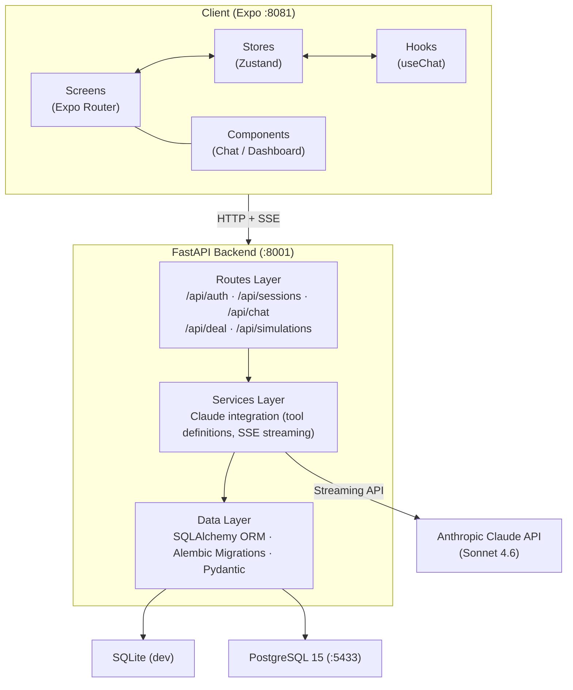
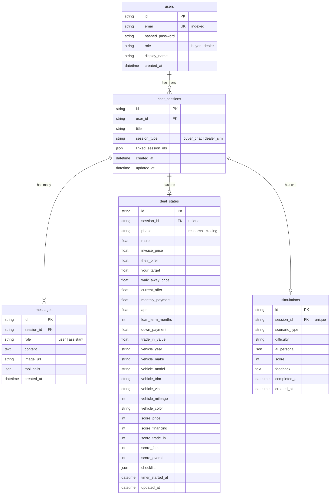

# Technical Requirements Document: Dealership AI

**Last updated: 2026-03**

---

## Table of Contents

1. [Overview](#1-overview)
2. [Architecture](#2-architecture)
3. [User Roles & Access](#3-user-roles--access)
4. [Authentication & Security](#4-authentication--security)
5. [API Contract](#5-api-contract)
6. [Core Business Rules](#6-core-business-rules)
7. [Data Model](#7-data-model)
8. [External Integrations](#8-external-integrations)
9. [Application Lifecycle](#9-application-lifecycle)
10. [Scheduled Jobs](#10-scheduled-jobs)

---

## 1. Overview

Dealership AI is a monorepo containing two AI-powered smartphone applications for the car buying experience: a **buyer app** that helps consumers understand deals, spot unauthorized charges, and negotiate effectively, and a **dealer app** that provides AI training simulations where salespeople practice against AI customer personas.

### Tech Stack


| Layer            | Technology                                             |
| ---------------- | ------------------------------------------------------ |
| Frontend         | React Native + Expo + Tamagui + Zustand                |
| Backend          | FastAPI + SQLAlchemy + Alembic                         |
| Database (dev)   | SQLite                                                 |
| Database (prod)  | PostgreSQL 15                                          |
| AI               | Anthropic Claude API (claude-sonnet-4-6) with tool use |
| Authentication   | JWT (HS256) + bcrypt                                   |
| Streaming        | Server-Sent Events (SSE)                               |
| Containerization | Docker Compose                                         |


### Repository Structure

```
dealership-ai/
├── apps/
│   ├── backend/          # FastAPI application
│   │   ├── app/
│   │   │   ├── core/     # Config, security, dependency injection
│   │   │   ├── db/       # Database engine, base model
│   │   │   ├── models/   # SQLAlchemy ORM models
│   │   │   ├── routes/   # API endpoint definitions
│   │   │   ├── schemas/  # Pydantic request/response models
│   │   │   └── services/ # Business logic (Claude integration)
│   │   └── migrations/   # Alembic database migrations
│   └── mobile/           # Expo React Native application
│       ├── app/          # Expo Router file-based routing
│       ├── components/   # Chat, Dashboard, Shared UI
│       ├── hooks/        # useChat, useScreenWidth
│       ├── lib/          # Colors, API client
│       └── stores/       # Zustand state management
├── docs/                 # Project documentation
├── docker-compose.yml
└── Makefile
```

---

## 2. Architecture



### Request Flow: Chat Message with Tool Use

1. Client sends `POST /api/chat/{session_id}/message` with user text (and optional image URL).
2. Backend saves the user message to the `messages` table.
3. Backend loads message history (last 20 messages) and current deal state.
4. Backend constructs a system prompt with deal state context and linked session context.
5. Backend opens a streaming connection to the Claude API with 5 tool definitions.
6. Claude streams back text chunks and tool calls.
7. Backend relays each chunk as an SSE event to the client:
  - `event: text` -- conversation text chunks
  - `event: tool_result` -- dashboard state updates (numbers, phase, scorecard, vehicle, checklist)
  - `event: done` -- final payload with full text and all tool calls
8. On stream completion, backend persists the assistant message and applies tool call results to `deal_states`.
9. Client Zustand stores update in real time as SSE events arrive.

---

## 3. User Roles & Access


| Role     | Description                                       | Access                                                                     |
| -------- | ------------------------------------------------- | -------------------------------------------------------------------------- |
| `buyer`  | Car buyer using the deal advisor                  | Own sessions (buyer_chat), own deal states, chat with AI advisor           |
| `dealer` | Dealership salesperson using training simulations | Own sessions (dealer_sim), simulation scenarios, practice with AI personas |


### Access Control Rules

- Role is set at signup and stored on the `users` record (`buyer` or `dealer`).
- All session, message, deal, and chat endpoints enforce **user-scoped access**: a user can only read/modify their own sessions (`ChatSession.user_id == current_user.id`).
- There is no admin role in the current version.
- Session type is determined at creation: `buyer_chat` for buyers, `dealer_sim` for dealers.

---

## 4. Authentication & Security

### Authentication Flow

1. **Signup** (`POST /api/auth/signup`): Accepts email, password, role, optional display name. Returns a JWT access token.
2. **Login** (`POST /api/auth/login`): Accepts email and password. Returns a JWT access token.
3. **Authenticated requests**: Include `Authorization: Bearer <token>` header. The `get_current_user` dependency decodes the token and loads the user.

### Token Specification


| Parameter      | Value                             |
| -------------- | --------------------------------- |
| Algorithm      | HS256                             |
| Signing key    | `SECRET_KEY` environment variable |
| Payload claim  | `sub` = user UUID                 |
| Default expiry | 480 minutes (8 hours)             |
| Library        | python-jose                       |


### Password Handling

- Passwords hashed with **bcrypt** (via the `bcrypt` Python package).
- Salt generated per password (`bcrypt.gensalt()`).
- Plaintext passwords never stored or logged.

### CORS

- Allowed origins configured via `CORS_ORIGINS` environment variable.
- Defaults: `http://localhost:8081`, `http://localhost:19006`.

### Environment Secrets


| Variable            | Purpose                    | Required   |
| ------------------- | -------------------------- | ---------- |
| `SECRET_KEY`        | JWT signing key            | Yes        |
| `ANTHROPIC_API_KEY` | Claude API access          | Yes        |
| `DATABASE_URL`      | Database connection string | Yes (prod) |


---

## 5. API Contract

### Route Summary


| Method   | Endpoint                          | Auth | Description                         |
| -------- | --------------------------------- | ---- | ----------------------------------- |
| `POST`   | `/api/auth/signup`                | No   | Create account, return token        |
| `POST`   | `/api/auth/login`                 | No   | Authenticate, return token          |
| `GET`    | `/api/sessions`                   | Yes  | List user's sessions                |
| `POST`   | `/api/sessions`                   | Yes  | Create session + empty deal state   |
| `GET`    | `/api/sessions/{session_id}`      | Yes  | Get single session                  |
| `PATCH`  | `/api/sessions/{session_id}`      | Yes  | Update title or linked sessions     |
| `DELETE` | `/api/sessions/{session_id}`      | Yes  | Delete session                      |
| `POST`   | `/api/chat/{session_id}/message`  | Yes  | Send message, receive SSE stream    |
| `GET`    | `/api/chat/{session_id}/messages` | Yes  | Get message history for session     |
| `GET`    | `/api/deal/{session_id}`          | Yes  | Get deal state for session          |
| `GET`    | `/api/simulations/scenarios`      | Yes  | List available simulation scenarios |


### SSE Event Format

All chat responses stream as `text/event-stream` with three event types:

```
event: text
data: {"chunk": "Here's what I think about..."}

event: tool_result
data: {"tool": "update_deal_numbers", "data": {"msrp": 35000, "their_offer": 33500}}

event: done
data: {"text": "Full response text...", "tool_calls": [{"name": "update_deal_numbers", "args": {...}}]}
```

For detailed endpoint schemas (request/response bodies, status codes), see the Pydantic schemas in `apps/backend/app/schemas/`.

---

## 6. Core Business Rules

### Deal Phases

A deal progresses through an ordered set of phases. Claude advances the phase via the `update_deal_phase` tool based on conversation context.


| Phase             | Description                             |
| ----------------- | --------------------------------------- |
| `research`        | Initial research, gathering information |
| `initial_contact` | First interaction with dealership       |
| `test_drive`      | Vehicle test drive                      |
| `negotiation`     | Price and terms negotiation             |
| `financing`       | F&I (Finance & Insurance) stage         |
| `closing`         | Final paperwork and signing             |


### Scorecard Ratings

Each deal dimension is rated on a three-level scale reflecting how the deal is going for the buyer:


| Rating   | Meaning                      |
| -------- | ---------------------------- |
| `green`  | Favorable for the buyer      |
| `yellow` | Caution, could be better     |
| `red`    | Unfavorable, needs attention |


Scorecard dimensions: **price**, **financing**, **trade_in**, **fees**, **overall**.

### Claude Tool Definitions

The AI advisor uses 5 tools to drive the frontend dashboard in real time:


| Tool                  | Purpose                                    | Required Fields                  |
| --------------------- | ------------------------------------------ | -------------------------------- |
| `update_deal_numbers` | Update financial figures on the dashboard  | None (all optional)              |
| `update_deal_phase`   | Advance deal to a new phase                | `phase`                          |
| `update_scorecard`    | Set red/yellow/green ratings               | None (all optional)              |
| `set_vehicle`         | Set or update the vehicle under discussion | `make`, `model`                  |
| `update_checklist`    | Update buyer's action item checklist       | `items` (array of {label, done}) |


### Session Linking

Sessions can reference other sessions via `linked_session_ids` (JSON array). When a linked session exists, the backend includes the last 10 messages from linked sessions as context in the Claude system prompt. This supports continuity across multiple dealership visits or conversations.

### Message History Limits

- Claude receives at most the **last 20 messages** from the current session (`CLAUDE_MAX_HISTORY`).
- Claude `max_tokens` per response: **1024** (configurable via `CLAUDE_MAX_TOKENS`).

### Simulation Scenarios

Dealer training scenarios are currently hardcoded (4 scenarios). Each defines:

- An AI persona with name, budget, personality, target vehicle, and specific challenges.
- A difficulty level: `easy`, `medium`, or `hard`.

---

## 7. Data Model

### Entity Relationship Diagram



### Table Definitions

#### `users`


| Column            | Type     | Constraints                 | Notes               |
| ----------------- | -------- | --------------------------- | ------------------- |
| `id`              | String   | PK, default UUID            |                     |
| `email`           | String   | Unique, Not Null, Indexed   |                     |
| `hashed_password` | String   | Not Null                    | bcrypt hash         |
| `role`            | String   | Not Null, default `"buyer"` | `buyer` or `dealer` |
| `display_name`    | String   | Nullable                    |                     |
| `created_at`      | DateTime | default now(UTC)            |                     |


#### `chat_sessions`


| Column               | Type     | Constraints                       | Notes                        |
| -------------------- | -------- | --------------------------------- | ---------------------------- |
| `id`                 | String   | PK, default UUID                  |                              |
| `user_id`            | String   | FK -> users.id, Not Null, Indexed |                              |
| `title`              | String   | Not Null, default "New Deal"      |                              |
| `session_type`       | String   | Not Null, default "buyer_chat"    | `buyer_chat` or `dealer_sim` |
| `linked_session_ids` | JSON     | default empty list                | Array of session UUIDs       |
| `created_at`         | DateTime | default now(UTC)                  |                              |
| `updated_at`         | DateTime | default now(UTC), on update       |                              |


#### `messages`


| Column       | Type     | Constraints                               | Notes                            |
| ------------ | -------- | ----------------------------------------- | -------------------------------- |
| `id`         | String   | PK, default UUID                          |                                  |
| `session_id` | String   | FK -> chat_sessions.id, Not Null, Indexed |                                  |
| `role`       | String   | Not Null                                  | `user`, `assistant`, or `system` |
| `content`    | Text     | Not Null                                  |                                  |
| `image_url`  | String   | Nullable                                  | URL for image analysis           |
| `tool_calls` | JSON     | Nullable                                  | Array of {name, args} objects    |
| `created_at` | DateTime | default now(UTC)                          |                                  |


#### `deal_states`


| Column             | Type     | Constraints                             | Notes                       |
| ------------------ | -------- | --------------------------------------- | --------------------------- |
| `id`               | String   | PK, default UUID                        |                             |
| `session_id`       | String   | FK -> chat_sessions.id, Unique, Indexed | One deal state per session  |
| `phase`            | String   | Not Null, default "research"            | See deal phases             |
| `msrp`             | Float    | Nullable                                |                             |
| `invoice_price`    | Float    | Nullable                                |                             |
| `their_offer`      | Float    | Nullable                                |                             |
| `your_target`      | Float    | Nullable                                |                             |
| `walk_away_price`  | Float    | Nullable                                |                             |
| `current_offer`    | Float    | Nullable                                |                             |
| `monthly_payment`  | Float    | Nullable                                |                             |
| `apr`              | Float    | Nullable                                |                             |
| `loan_term_months` | Integer  | Nullable                                |                             |
| `down_payment`     | Float    | Nullable                                |                             |
| `trade_in_value`   | Float    | Nullable                                |                             |
| `vehicle_year`     | Integer  | Nullable                                |                             |
| `vehicle_make`     | String   | Nullable                                |                             |
| `vehicle_model`    | String   | Nullable                                |                             |
| `vehicle_trim`     | String   | Nullable                                |                             |
| `vehicle_vin`      | String   | Nullable                                |                             |
| `vehicle_mileage`  | Integer  | Nullable                                |                             |
| `vehicle_color`    | String   | Nullable                                |                             |
| `score_price`      | String   | Nullable                                | `red`, `yellow`, or `green` |
| `score_financing`  | String   | Nullable                                | `red`, `yellow`, or `green` |
| `score_trade_in`   | String   | Nullable                                | `red`, `yellow`, or `green` |
| `score_fees`       | String   | Nullable                                | `red`, `yellow`, or `green` |
| `score_overall`    | String   | Nullable                                | `red`, `yellow`, or `green` |
| `checklist`        | JSON     | default empty list                      | Array of {label, done}      |
| `timer_started_at` | DateTime | Nullable                                | Negotiation timer           |
| `updated_at`       | DateTime | default now(UTC), on update             |                             |


#### `simulations`


| Column          | Type     | Constraints                             | Notes                                            |
| --------------- | -------- | --------------------------------------- | ------------------------------------------------ |
| `id`            | String   | PK, default UUID                        |                                                  |
| `session_id`    | String   | FK -> chat_sessions.id, Unique, Indexed | One simulation per session                       |
| `scenario_type` | String   | Not Null                                |                                                  |
| `difficulty`    | String   | Not Null, default "medium"              | `easy`, `medium`, or `hard`                      |
| `ai_persona`    | JSON     | Not Null                                | {name, budget, personality, vehicle, challenges} |
| `score`         | Float    | Nullable                                | Performance score after completion               |
| `feedback`      | Text     | Nullable                                | AI-generated feedback                            |
| `completed_at`  | DateTime | Nullable                                |                                                  |
| `created_at`    | DateTime | default now(UTC)                        |                                                  |


### Key Relationships

- **User -> ChatSession**: One-to-many. A user owns many sessions.
- **ChatSession -> Message**: One-to-many. A session contains an ordered sequence of messages.
- **ChatSession -> DealState**: One-to-one. Each session has exactly one deal state (created when the session is created).
- **ChatSession -> Simulation**: One-to-one. A dealer_sim session has one simulation record.

### ID Strategy

All primary keys are UUIDv4 strings, generated at the application layer via `uuid.uuid4()`.

---

## 8. External Integrations

### Anthropic Claude API


| Parameter      | Value                  |
| -------------- | ---------------------- |
| Model          | `claude-sonnet-4-6`    |
| Max tokens     | 1024 (configurable)    |
| Tool use       | 5 tool definitions     |
| Streaming      | Yes (messages.stream)  |
| Image input    | Supported (URL-based)  |
| Client library | `anthropic` Python SDK |


The integration uses the synchronous Anthropic client with the `.messages.stream()` context manager. Text deltas and tool call results are relayed to the frontend as SSE events in real time. The `done` event aggregates the full response for persistence.

### No Other External Integrations (v1)

The first version has no integrations with vehicle pricing APIs, CARFAX, credit bureaus, or payment processors. All deal analysis is performed by Claude based on user-provided information.

---

## 9. Application Lifecycle

### Backend Startup (Lifespan Handler)

The FastAPI application uses an `asynccontextmanager` lifespan handler (not the deprecated `on_event("startup")` pattern) to perform startup tasks:

1. **Create database tables** -- `Base.metadata.create_all()` ensures all tables exist (no-op if they already exist).
2. **Seed development users** -- When `ENV=development` (the default), two test users are created:

| Email | Password | Role |
|-------|----------|------|
| `buyer@test.com` | `password` | buyer |
| `dealer@test.com` | `password` | dealer |

Seeding is idempotent (skips existing users) and only runs in development mode.

### Frontend Auth Guards

The `AuthGuard` component (`components/shared/AuthGuard.tsx`) wraps the `(buyer)` and `(dealer)` route group layouts. It checks for an authenticated user in the auth store and redirects to the login screen if no valid session exists. This ensures all app routes (except auth screens) require authentication.

The login screen displays quick sign-in buttons for the seed user accounts when running in development mode (`__DEV__`).

### Backend Enums

All domain string values are defined as Python `StrEnum` types in `app/models/enums.py` for type safety and consistency:

| Enum | Values |
|------|--------|
| `UserRole` | `buyer`, `dealer` |
| `SessionType` | `buyer_chat`, `dealer_sim` |
| `MessageRole` | `user`, `assistant`, `system` |
| `DealPhase` | `research`, `initial_contact`, `test_drive`, `negotiation`, `financing`, `closing` |
| `ScoreStatus` | `red`, `yellow`, `green` |
| `Difficulty` | `easy`, `medium`, `hard` |

### Frontend Error Handling

- **Optimistic message rollback**: When sending a chat message, the user message is added to the store optimistically. If the backend request fails, the message is removed from the store.
- **Event-based SSE parsing**: The `useChat` hook uses an event-based approach to parse SSE streams, dispatching `text`, `tool_result`, and `done` events to the appropriate store handlers.
- **Error handling in stores and auth screens**: All Zustand stores and auth screens include try/catch error handling with user-facing error state.

---

## 10. Scheduled Jobs

There are no scheduled jobs, cron tasks, or background workers in the current version. All processing is synchronous and request-driven:

- Chat responses stream in real time during the HTTP request lifecycle.
- Deal state updates are applied inline after the Claude stream completes.
- Database writes happen within the request transaction.

Future versions may introduce background jobs for tasks such as session summarization, usage analytics, or simulation scoring pipelines.

---

## Port Reference


| Service    | Port | Notes                           |
| ---------- | ---- | ------------------------------- |
| Frontend   | 8081 | Expo dev server (web)           |
| Backend    | 8001 | FastAPI with uvicorn            |
| PostgreSQL | 5433 | Mapped from container port 5432 |


