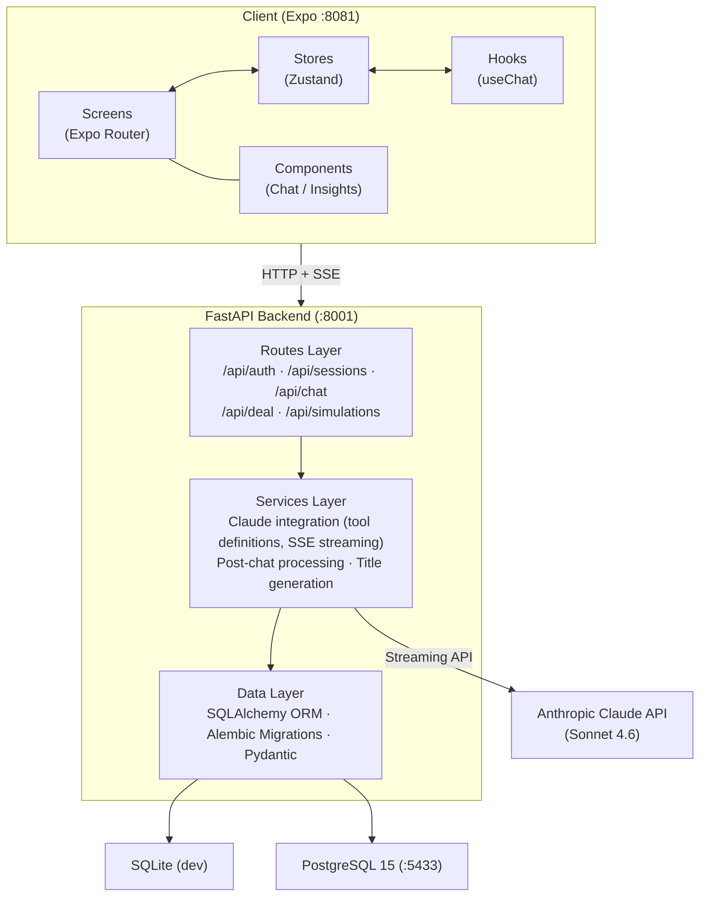
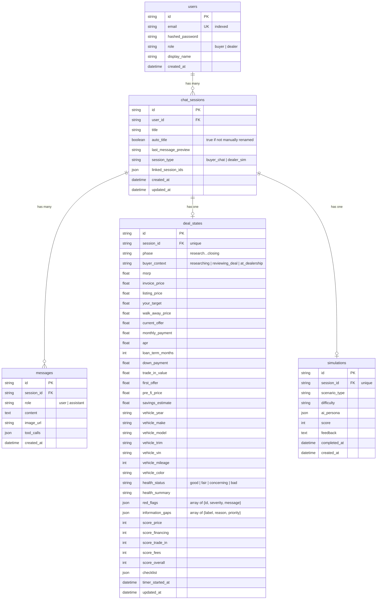

# Technical Requirements Document: Dealership AI

**Last updated: 2026-03-26**

---

## Table of Contents

1. [Overview](#1-overview)
2. [Architecture](#2-architecture)
3. [User Roles & Access](#3-user-roles--access)
4. [Authentication & Security](#4-authentication--security)
5. [API Contract](#5-api-contract)
6. [Core Business Rules](#6-core-business-rules)
7. [Data Model](#7-data-model)
8. [External Integrations](#8-external-integrations)
9. [Application Lifecycle](#9-application-lifecycle)
10. [Scheduled Jobs](#10-scheduled-jobs)

---

## 1. Overview

Dealership AI is a monorepo containing a unified AI-powered smartphone application for the car buying experience, with role-based access for two user types: a **buyer experience** that helps consumers understand deals, spot unauthorized charges, and negotiate effectively, and a **dealer experience** that provides AI training simulations where salespeople practice against AI customer personas. Both experiences live within a single app, with the user's role (selected at registration) determining which screens are accessible.

### Tech Stack


| Layer            | Technology                                             |
| ---------------- | ------------------------------------------------------ |
| Frontend         | React Native + Expo + Tamagui + Zustand                |
| Backend          | FastAPI + SQLAlchemy + Alembic                         |
| Database (dev)   | SQLite                                                 |
| Database (prod)  | PostgreSQL 15                                          |
| AI               | Anthropic Claude API — Sonnet 4.6 (primary) + Haiku 4.5 (fast tasks) — with tool use |
| Authentication   | JWT (HS256) + bcrypt                                   |
| Streaming        | Server-Sent Events (SSE)                               |
| Containerization | Docker Compose                                         |


### Repository Structure

```
dealership-ai/
├── apps/
│   ├── backend/          # FastAPI application
│   │   ├── app/
│   │   │   ├── core/     # Config, security, dependency injection
│   │   │   ├── db/       # Database engine, base model
│   │   │   ├── models/   # SQLAlchemy ORM models
│   │   │   ├── routes/   # API endpoint definitions
│   │   │   ├── schemas/  # Pydantic request/response models
│   │   │   └── services/ # Business logic (Claude integration)
│   │   └── migrations/   # Alembic database migrations
│   └── mobile/           # Expo React Native application
│       ├── app/          # Expo Router file-based routing
│       ├── components/   # Chat, Chats (session list), Insights, Shared UI
│       ├── hooks/        # useChat, useScreenWidth, useIconEntrance
│       ├── lib/          # Theme (tokens + themes), API client
│       └── stores/       # Zustand state management
├── docs/                 # Project documentation
├── docker-compose.yml
└── Makefile
```

---

## 2. Architecture



### Request Flow: Chat Message with Tool Use

1. Client sends `POST /api/chat/{session_id}/message` with user text (and optional image URL).
2. Backend saves the user message to the `messages` table.
3. Backend loads message history (last 20 messages) and current deal state.
4. Backend constructs a system prompt with deal state context, a context-aware preamble based on `buyer_context`, and linked session context.
5. Backend opens a streaming connection to the Claude API (Sonnet) with 10 tool definitions.
6. Claude streams back text chunks and tool calls.
7. Backend relays each chunk as an SSE event to the client:
  - `event: text` -- conversation text chunks
  - `event: tool_result` -- dashboard state updates (numbers, phase, scorecard, vehicle, checklist, quick actions, deal health, red flags, information gaps)
  - `event: done` -- final payload with full text and all tool calls
8. **Two-pass follow-up:** If Claude responded with only tool calls and no text, a second lightweight call (no tools) generates the conversational response, streamed as additional `event: text` chunks with `event: followup_done` at completion.
9. **Server-side quick actions:** If Claude didn't call `update_quick_actions`, the backend generates suggestions via Haiku (`CLAUDE_FAST_MODEL`) and emits them as a `tool_result` SSE event.
10. **Assessment safety net:** If Claude updated deal numbers but didn't call `update_deal_health` or `update_red_flags`, the backend runs `assess_deal_state()` via Haiku to generate health status and red flags.
11. On stream completion, backend persists the assistant message (including any follow-up text) and applies tool call results to `deal_states`.
12. **Post-chat processing:** After tool calls are applied, `update_session_metadata()` updates the session's `last_message_preview` (truncated assistant response) and auto-generates a title when `auto_title` is true — deterministic vehicle title if `set_vehicle` was called, otherwise LLM-generated via Haiku on the first exchange.
13. Client Zustand stores update in real time as SSE events arrive. The frontend `snakeToCamel` utility converts backend snake_case field names to camelCase for Zustand stores.

---

## 3. User Roles & Access


| Role     | Description                                       | Access                                                                     |
| -------- | ------------------------------------------------- | -------------------------------------------------------------------------- |
| `buyer`  | Car buyer using the deal advisor                  | Own sessions (buyer_chat), own deal states, chat with AI advisor           |
| `dealer` | Dealership salesperson using training simulations | Own sessions (dealer_sim), simulation scenarios, practice with AI personas |


### Access Control Rules

- Role is set at signup (user selects "Buying" or "Selling" during registration) and stored on the `users` record (`buyer` or `dealer`).
- All session, message, deal, and chat endpoints enforce **user-scoped access**: a user can only read/modify their own sessions (`ChatSession.user_id == current_user.id`).
- **Role enforcement on session creation**: buyers can only create `buyer_chat` sessions; dealers can only create `dealer_sim` sessions. Returns `403 Forbidden` on mismatch.
- **Role enforcement on simulations**: only dealers can access the `/api/simulations/scenarios` endpoint. Returns `403 Forbidden` for buyers.
- **Linked session ownership validation**: when updating `linked_session_ids`, the backend verifies all linked sessions belong to the current user. Returns `403 Forbidden` if any linked session is not owned.
- There is no admin role in the current version.
- Role switching is available only in development mode (`__DEV__`).
- Session type is determined at creation: `buyer_chat` for buyers, `dealer_sim` for dealers.

---

## 4. Authentication & Security

### Authentication Flow

1. **Signup** (`POST /api/auth/signup`): Accepts email, password, role, optional display name. Returns a JWT access token.
2. **Login** (`POST /api/auth/login`): Accepts email and password. Returns a JWT access token.
3. **Authenticated requests**: Include `Authorization: Bearer <token>` header. The `get_current_user` dependency decodes the token and loads the user.

### Token Specification


| Parameter      | Value                             |
| -------------- | --------------------------------- |
| Algorithm      | HS256                             |
| Signing key    | `SECRET_KEY` environment variable |
| Payload claim  | `sub` = user UUID                 |
| Default expiry | 480 minutes (8 hours)             |
| Library        | python-jose                       |


### Password Handling

- Passwords hashed with **bcrypt** (via the `bcrypt` Python package).
- Salt generated per password (`bcrypt.gensalt()`).
- Plaintext passwords never stored or logged.

### CORS

- Allowed origins configured via `CORS_ORIGINS` environment variable.
- Defaults: `http://localhost:8081`, `http://localhost:19006`.

### Environment Secrets


| Variable            | Purpose                    | Required   |
| ------------------- | -------------------------- | ---------- |
| `SECRET_KEY`        | JWT signing key            | Yes        |
| `ANTHROPIC_API_KEY` | Claude API access          | Yes        |
| `DATABASE_URL`      | Database connection string | Yes (prod) |


---

## 5. API Contract

### Route Summary


| Method   | Endpoint                          | Auth | Description                         |
| -------- | --------------------------------- | ---- | ----------------------------------- |
| `POST`   | `/api/auth/signup`                | No   | Create account, return token        |
| `POST`   | `/api/auth/login`                 | No   | Authenticate, return token          |
| `GET`    | `/api/sessions`                   | Yes  | List user's sessions (optional `?q=` search) |
| `POST`   | `/api/sessions`                   | Yes  | Create session + deal state (with optional buyer_context) |
| `GET`    | `/api/sessions/{session_id}`      | Yes  | Get single session                  |
| `PATCH`  | `/api/sessions/{session_id}`      | Yes  | Update title or linked sessions     |
| `DELETE` | `/api/sessions/{session_id}`      | Yes  | Delete session                      |
| `POST`   | `/api/chat/{session_id}/message`  | Yes  | Send message, receive SSE stream    |
| `GET`    | `/api/chat/{session_id}/messages` | Yes  | Get message history for session     |
| `GET`    | `/api/deal/{session_id}`          | Yes  | Get deal state for session          |
| `PATCH`  | `/api/deal/{session_id}`          | Yes  | User corrections → Haiku re-assessment |
| `GET`    | `/api/simulations/scenarios`      | Yes  | List available simulation scenarios |


### SSE Event Format

All chat responses stream as `text/event-stream` with these event types:

```
event: text
data: {"chunk": "Here's what I think about..."}

event: tool_result
data: {"tool": "update_deal_numbers", "data": {"msrp": 35000, "listing_price": 33500}}

event: done
data: {"text": "Full response text...", "tool_calls": [{"name": "update_deal_numbers", "args": {...}}]}

event: followup_done
data: {"text": "Full follow-up text..."}
```

The `followup_done` event only appears when the primary response had tool calls but no text (two-pass architecture). The follow-up text chunks are streamed as regular `text` events before the `followup_done` event.

For detailed endpoint schemas (request/response bodies, status codes), see the Pydantic schemas in `apps/backend/app/schemas/`.

---

## 6. Core Business Rules

### Deal Phases

A deal progresses through an ordered set of phases. Claude advances the phase via the `update_deal_phase` tool based on conversation context.


| Phase             | Description                             |
| ----------------- | --------------------------------------- |
| `research`        | Initial research, gathering information |
| `initial_contact` | First interaction with dealership       |
| `test_drive`      | Vehicle test drive                      |
| `negotiation`     | Price and terms negotiation             |
| `financing`       | F&I (Finance & Insurance) stage         |
| `closing`         | Final paperwork and signing             |


### Scorecard Ratings

Each deal dimension is rated on a three-level scale reflecting how the deal is going for the buyer:


| Rating   | Meaning                      |
| -------- | ---------------------------- |
| `green`  | Favorable for the buyer      |
| `yellow` | Caution, could be better     |
| `red`    | Unfavorable, needs attention |


Scorecard dimensions: **price**, **financing**, **trade_in**, **fees**, **overall**.

### Claude Tool Definitions

The AI advisor uses 10 tools to drive the frontend dashboard and quick actions in real time:


| Tool                     | Purpose                                    | Required Fields                  |
| ------------------------ | ------------------------------------------ | -------------------------------- |
| `update_deal_numbers`    | Update financial figures on the dashboard  | None (all optional)              |
| `update_deal_phase`      | Advance deal to a new phase                | `phase`                          |
| `update_scorecard`       | Set red/yellow/green ratings               | None (all optional)              |
| `set_vehicle`            | Set or update the vehicle under discussion | `make`, `model`                  |
| `update_checklist`       | Update buyer's action item checklist       | `items` (array of {label, done}) |
| `update_quick_actions`   | Suggest 2-3 dynamic quick action buttons   | `actions` (array of {label, prompt}) |
| `update_buyer_context`   | Change buyer's situational context mid-conversation | `buyer_context` |
| `update_deal_health`     | Overall deal health assessment (status + summary) | `status`, `summary` |
| `update_red_flags`       | Surface specific deal problems with severity | `flags` (array of {id, severity, message}) |
| `update_information_gaps` | Identify missing data to improve assessment | `gaps` (array of {label, reason, priority}) |


### Session Linking

Sessions can reference other sessions via `linked_session_ids` (JSON array). When a linked session exists, the backend includes the last 10 messages from linked sessions as context in the Claude system prompt. This supports continuity across multiple dealership visits or conversations.

### Message History Limits

- Claude receives at most the **last 20 messages** from the current session (`CLAUDE_MAX_HISTORY`).
- Claude `max_tokens` per response: **4096** (configurable via `CLAUDE_MAX_TOKENS`).

### Simulation Scenarios

Dealer training scenarios are currently hardcoded (4 scenarios). Each defines:

- An AI persona with name, budget, personality, target vehicle, and specific challenges.
- A difficulty level: `easy`, `medium`, or `hard`.

---

## 7. Data Model

### Entity Relationship Diagram



### Table Definitions

#### `users`


| Column            | Type     | Constraints                 | Notes               |
| ----------------- | -------- | --------------------------- | ------------------- |
| `id`              | String   | PK, default UUID            |                     |
| `email`           | String   | Unique, Not Null, Indexed   |                     |
| `hashed_password` | String   | Not Null                    | bcrypt hash         |
| `role`            | String   | Not Null, default `"buyer"` | `buyer` or `dealer` |
| `display_name`    | String   | Nullable                    |                     |
| `created_at`      | DateTime | default now(UTC)            |                     |


#### `chat_sessions`


| Column                 | Type     | Constraints                       | Notes                        |
| ---------------------- | -------- | --------------------------------- | ---------------------------- |
| `id`                   | String   | PK, default UUID                  |                              |
| `user_id`              | String   | FK -> users.id, Not Null, Indexed |                              |
| `title`                | String   | Not Null, default "New Deal"      |                              |
| `auto_title`           | Boolean  | Not Null, default `true`          | False when user manually renames |
| `last_message_preview` | String   | Not Null, default `""`            | Truncated last assistant message (max 120 chars) |
| `session_type`         | String   | Not Null, default "buyer_chat"    | `buyer_chat` or `dealer_sim` |
| `linked_session_ids`   | JSON     | default empty list                | Array of session UUIDs       |
| `created_at`           | DateTime | default now(UTC)                  |                              |
| `updated_at`           | DateTime | default now(UTC), on update       |                              |


#### `messages`


| Column       | Type     | Constraints                               | Notes                            |
| ------------ | -------- | ----------------------------------------- | -------------------------------- |
| `id`         | String   | PK, default UUID                          |                                  |
| `session_id` | String   | FK -> chat_sessions.id, Not Null, Indexed |                                  |
| `role`       | String   | Not Null                                  | `user`, `assistant`, or `system` |
| `content`    | Text     | Not Null                                  |                                  |
| `image_url`  | String   | Nullable                                  | URL for image analysis           |
| `tool_calls` | JSON     | Nullable                                  | Array of {name, args} objects    |
| `created_at` | DateTime | default now(UTC)                          |                                  |


#### `deal_states`


| Column             | Type     | Constraints                             | Notes                       |
| ------------------ | -------- | --------------------------------------- | --------------------------- |
| `id`               | String   | PK, default UUID                        |                             |
| `session_id`       | String   | FK -> chat_sessions.id, Unique, Indexed | One deal state per session  |
| `phase`            | String   | Not Null, default "research"            | See deal phases             |
| `buyer_context`    | String   | Not Null, default "researching"         | `researching`, `reviewing_deal`, or `at_dealership` |
| `msrp`             | Float    | Nullable                                |                             |
| `invoice_price`    | Float    | Nullable                                |                             |
| `listing_price`      | Float    | Nullable                                |                             |
| `your_target`      | Float    | Nullable                                |                             |
| `walk_away_price`  | Float    | Nullable                                |                             |
| `current_offer`    | Float    | Nullable                                |                             |
| `monthly_payment`  | Float    | Nullable                                |                             |
| `apr`              | Float    | Nullable                                |                             |
| `loan_term_months` | Integer  | Nullable                                |                             |
| `down_payment`     | Float    | Nullable                                |                             |
| `trade_in_value`   | Float    | Nullable                                |                             |
| `vehicle_year`     | Integer  | Nullable                                |                             |
| `vehicle_make`     | String   | Nullable                                |                             |
| `vehicle_model`    | String   | Nullable                                |                             |
| `vehicle_trim`     | String   | Nullable                                |                             |
| `vehicle_vin`      | String   | Nullable                                |                             |
| `vehicle_mileage`  | Integer  | Nullable                                |                             |
| `vehicle_color`    | String   | Nullable                                |                             |
| `score_price`      | String   | Nullable                                | `red`, `yellow`, or `green` |
| `score_financing`  | String   | Nullable                                | `red`, `yellow`, or `green` |
| `score_trade_in`   | String   | Nullable                                | `red`, `yellow`, or `green` |
| `score_fees`       | String   | Nullable                                | `red`, `yellow`, or `green` |
| `score_overall`    | String   | Nullable                                | `red`, `yellow`, or `green` |
| `health_status`    | String   | Nullable                                | `good`, `fair`, `concerning`, `bad` |
| `health_summary`   | String   | Nullable                                | 1-2 sentence explanation    |
| `red_flags`        | JSON     | default empty list                      | Array of {id, severity, message} |
| `information_gaps` | JSON     | default empty list                      | Array of {label, reason, priority} |
| `first_offer`      | Float    | Nullable                                | Snapshot of first current_offer |
| `pre_fi_price`     | Float    | Nullable                                | Price before F&I stage      |
| `savings_estimate` | Float    | Nullable                                | Estimated buyer savings     |
| `checklist`        | JSON     | default empty list                      | Array of {label, done}      |
| `timer_started_at` | DateTime | Nullable                                | Negotiation timer           |
| `updated_at`       | DateTime | default now(UTC), on update             |                             |


#### `simulations`


| Column          | Type     | Constraints                             | Notes                                            |
| --------------- | -------- | --------------------------------------- | ------------------------------------------------ |
| `id`            | String   | PK, default UUID                        |                                                  |
| `session_id`    | String   | FK -> chat_sessions.id, Unique, Indexed | One simulation per session                       |
| `scenario_type` | String   | Not Null                                |                                                  |
| `difficulty`    | String   | Not Null, default "medium"              | `easy`, `medium`, or `hard`                      |
| `ai_persona`    | JSON     | Not Null                                | {name, budget, personality, vehicle, challenges} |
| `score`         | Float    | Nullable                                | Performance score after completion               |
| `feedback`      | Text     | Nullable                                | AI-generated feedback                            |
| `completed_at`  | DateTime | Nullable                                |                                                  |
| `created_at`    | DateTime | default now(UTC)                        |                                                  |


### Key Relationships

- **User -> ChatSession**: One-to-many. A user owns many sessions.
- **ChatSession -> Message**: One-to-many. A session contains an ordered sequence of messages. **Cascade delete**: messages are deleted when the session is deleted.
- **ChatSession -> DealState**: One-to-one. Each session has exactly one deal state (created when the session is created). **Cascade delete**: deal state is deleted when the session is deleted.
- **ChatSession -> Simulation**: One-to-one. A dealer_sim session has one simulation record. **Cascade delete**: simulation is deleted when the session is deleted.

### ID Strategy

All primary keys are UUIDv4 strings, generated at the application layer via `uuid.uuid4()`.

---

## 8. External Integrations

### Anthropic Claude API


| Parameter      | Value                  |
| -------------- | ---------------------- |
| Primary model  | `claude-sonnet-4-6` (`CLAUDE_MODEL`)    |
| Fast model     | `claude-haiku-4-5-20251001` (`CLAUDE_FAST_MODEL`) — quick action generation, session title generation, deal assessment safety net |
| Max tokens     | 4096 (configurable via `CLAUDE_MAX_TOKENS`)    |
| Tool use       | 10 tool definitions (primary model only)   |
| Streaming      | Yes (messages.stream)  |
| Image input    | Supported (URL-based)  |
| Client library | `anthropic` Python SDK |


The primary integration uses the synchronous Anthropic client with `.messages.stream()`. Text deltas and tool call results are relayed to the frontend as SSE events in real time. The `done` event aggregates the full response for persistence. A two-pass architecture handles tool-only responses: if the primary call returns tools but no text, a follow-up text-only call generates the conversational response. Quick action generation, session title generation, and deal assessment safety net (`assess_deal_state`) all use the async Anthropic client with the fast model (Haiku).

### No Other External Integrations (v1)

The first version has no integrations with vehicle pricing APIs, CARFAX, credit bureaus, or payment processors. All deal analysis is performed by Claude based on user-provided information.

---

## 9. Application Lifecycle

### Backend Startup (Lifespan Handler)

The FastAPI application uses an `asynccontextmanager` lifespan handler (not the deprecated `on_event("startup")` pattern) to perform startup tasks:

1. **Create database tables** -- `Base.metadata.create_all()` ensures all tables exist (no-op if they already exist).
2. **Seed development users** -- When `ENV=development` (the default), two test users are created:

| Email | Password | Role |
|-------|----------|------|
| `buyer@test.com` | `password` | buyer |
| `dealer@test.com` | `password` | dealer |

Seeding is idempotent (skips existing users) and only runs in development mode.

### Frontend Auth Guards and Role Guards

The `AuthGuard` component (`components/shared/AuthGuard.tsx`) wraps the unified `(app)` route group layout. It checks for an authenticated user in the auth store and redirects to the login screen if no valid session exists. This ensures all app routes (except auth screens) require authentication.

The `RoleGuard` component (`components/shared/RoleGuard.tsx`) is used within individual screens to enforce role-based access. If the user's role does not match the required role, `RoleGuard` redirects to the appropriate default screen for their actual role (e.g., a buyer trying to access simulations is redirected to chat). This replaces the previous architecture of separate `(buyer)` and `(dealer)` route groups.

The login screen displays quick sign-in buttons for the seed user accounts when running in development mode (`__DEV__`).

The registration screen asks "Are you buying or selling?" and presents "Buying" and "Selling" buttons for role selection.

### Backend Enums

All domain string values are defined as Python `StrEnum` types in `app/models/enums.py` for type safety and consistency:

| Enum | Values |
|------|--------|
| `UserRole` | `buyer`, `dealer` |
| `SessionType` | `buyer_chat`, `dealer_sim` |
| `MessageRole` | `user`, `assistant`, `system` |
| `DealPhase` | `research`, `initial_contact`, `test_drive`, `negotiation`, `financing`, `closing` |
| `ScoreStatus` | `red`, `yellow`, `green` |
| `BuyerContext` | `researching`, `reviewing_deal`, `at_dealership` |
| `HealthStatus` | `good`, `fair`, `concerning`, `bad` |
| `RedFlagSeverity` | `warning`, `critical` |
| `GapPriority` | `high`, `medium`, `low` |
| `Difficulty` | `easy`, `medium`, `hard` |

### Frontend Patterns

- **snake_case to camelCase mapping**: The `snakeToCamel` utility (`lib/utils.ts`) converts backend snake_case keys to frontend camelCase, replacing hand-mapped field assignments in the deal store.
- **Markdown rendering**: Assistant chat bubbles render content as Markdown via `react-native-markdown-display`, supporting bold, italic, lists, code blocks, blockquotes, and links. User messages render as plain text.
- **Optimistic message rollback**: When sending a chat message, the user message is added to the store optimistically. If the backend request fails, the message is removed from the store.
- **Duplicate user message prevention**: Message history is loaded BEFORE the user message is saved to the database, so the current message is not duplicated in the Claude context.
- **Event-based SSE parsing**: The `useChat` hook uses an event-based approach to parse SSE streams, dispatching `text`, `tool_result`, `followup_done`, and `done` events to the appropriate store handlers.
- **Error handling in stores and auth screens**: All Zustand stores and auth screens include try/catch error handling with user-facing error state.
- **Chats list as buyer home screen**: The `/(app)/chats` screen is the buyer's landing page, showing sessions in Active/Past sections with search, pull-to-refresh, and SessionCard components displaying phase dot, message preview, and deal summary line.
- **Auto-generated session titles**: Sessions receive automatic titles — deterministic vehicle titles when a vehicle is set, LLM-generated via Haiku as a fallback. Manual renames via PATCH set `auto_title=false`, preventing further auto-updates.
- **Animated icon transitions**: The `useIconEntrance` hook provides animated entrance effects for navigation icons (e.g., settings gear, back button) when transitioning between screens.

---

## 10. Scheduled Jobs

There are no scheduled jobs, cron tasks, or background workers in the current version. All processing is synchronous and request-driven:

- Chat responses stream in real time during the HTTP request lifecycle.
- Deal state updates are applied inline after the Claude stream completes.
- Database writes happen within the request transaction.

Future versions may introduce background jobs for tasks such as session summarization, usage analytics, or simulation scoring pipelines.

---

## Port Reference


| Service    | Port | Notes                           |
| ---------- | ---- | ------------------------------- |
| Frontend   | 8081 | Expo dev server (web)           |
| Backend    | 8001 | FastAPI with uvicorn            |
| PostgreSQL | 5433 | Mapped from container port 5432 |


