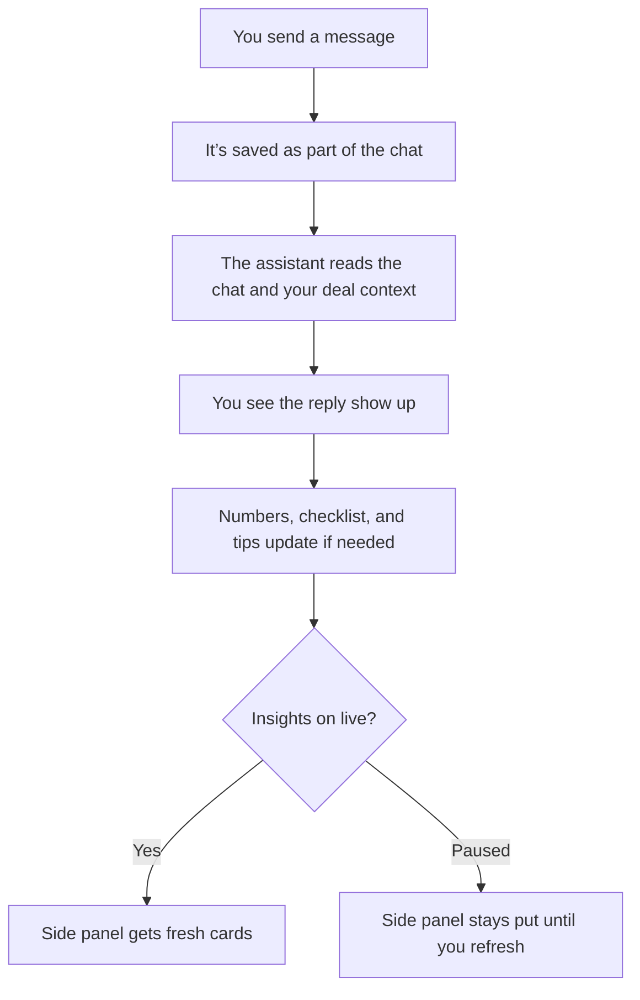

# Buyer chat turn lifecycle

**Last updated:** 2026-04-20

End-to-end flow for a single **buyer** message on `POST /api/chat/{session_id}/message` or `POST /api/chat/{session_id}/messages/{message_id}/branch`. Dealer simulation uses related chat infrastructure but different prompts and tools; this document is scoped to the **shared buyer turn** pipeline.

## Table of contents

- [Terminology](#terminology)
- [One turn at a glance](#one-turn-at-a-glance) — [simple](#simple-version) · [technical](#technical-version)
- [HTTP entry points](#http-entry-points)
- [Backend orchestration](#backend-orchestration)
- [Step loop (Claude)](#step-loop-claude)
- [SSE events (client-visible)](#sse-events-client-visible)
- [Mobile client behavior](#mobile-client-behavior)
- [Detached insights follow-up](#detached-insights-follow-up)
- [Interruptions and errors](#interruptions-and-errors)
- [Logging and debugging](#logging-and-debugging)
- [Related documentation](#related-documentation)

---

## Terminology

| Term | Meaning |
|------|--------|
| **Turn** | One user message → one completed assistant reply for that request. Insights follow-up may run as a separate request after chat completion. |
| **Step** | One Claude API call within the turn: stream text and/or `tool_use`, execute tools, append results to the transcript, then possibly another step. |

The step loop is capped (`CHAT_LOOP_MAX_STEPS` in `app/services/claude/chat_loop.py`). Tool choice tightens across steps (`app/services/claude/tool_policy.py`) to limit runaway tool rounds.

---

## One turn at a glance

### Simple version

In one exchange, you ask something and the assistant answers. When **live** insights are on, the chat can also update structured deal state during the turn and then refresh the side panel afterward. When they are **paused**, the system does not expose persistence-affecting buyer tools for that chat turn, and the side panel waits until you tap refresh.



**Paused insights** blocks automatic **panel regeneration** and also blocks buyer chat tools that persist structured deal or panel-related state for that turn. The app will not save deal, vehicle, checklist, score, gap, red-flag, or negotiation-context updates during the paused turn, and it skips the automatic post-`done` panel follow-up until the user explicitly refreshes.

### Technical version

The user sends one message; the backend saves it, runs one or more **Claude steps** (each step = one model call that may stream text and/or call tools); when the model answers with **text only** — or when step 0 produces a substantive pre-tool reply (≥150 chars) alongside tool calls, which short-circuits the continuation step per ADR 0026 — the backend **persists the assistant row**, emits **`done`**, and closes the chat SSE response. After `done`, the mobile client opens a **second** SSE request keyed by the assistant message id when insights are **live**: that detached follow-up runs panel generation (no reconcile pass as of ADR 0026).

```mermaid
sequenceDiagram
  autonumber
  actor User as User
  participant Client as Mobile client
  participant Stream as Backend (buyer_chat_stream)
  participant Claude as Claude Sonnet
  participant DB as Database

  User->>Client: Send message
  Client->>Stream: POST /message (SSE response open)
  Note over Stream: Optional compaction; build context
  Stream->>DB: Persist user message

  loop Step loop until text-only finish or cap
    Stream->>Claude: Chat completion (history + tools)
    Claude-->>Stream: Stream tokens
    Stream-->>Client: SSE text (typing / partial reply)
    alt Model ends with tool_use
      Stream->>DB: Execute tools, validate, commit writes
      Stream-->>Client: SSE tool_result events
      Note over Client: Buffer tool_result; sidebar updates after done
      Stream->>Claude: Next step with tool results in transcript
    else Model ends with no tools
      Note over Stream,Claude: Turn text complete
    end
  end

  Stream->>DB: Insert assistant message, commit
  Stream-->>Client: SSE done (final text + usage + assistant_message_id)
  Client->>Client: Flush buffers → deal store
  Stream-->>Client: HTTP stream closes

  Client->>Stream: POST /insights-followup (SSE response open)

  opt Insights update mode = live
    Stream-->>Client: SSE panel_started
    Note over Stream: Deterministic render for 9 card kinds (no LLM);
    Stream->>Claude: Narrow narrative synthesis for dealer_read / next_best_move / if_you_say_yes
    Stream-->>Client: SSE panel_done (merged + canonicalized cards)
  end
```

**Branch (`/branch`):** before step 1, the backend runs `session_branch` (truncate after anchor, reset commerce state) in a committed transaction, then follows the same sequence. **Paused insights:** the second request is skipped and the chat loop exposes only explicitly allowed chat-only tools.

---

## HTTP entry points

1. **`POST …/message`** — Normal send; optional `existing_user_message_id` resumes on the latest pre-persisted user row (VIN intercept flows).
2. **`POST …/messages/{message_id}/branch`** — Edit-from-here: `session_branch.py` runs a prepare transaction (truncate after anchor, reset commerce/usage/compaction per ADR 0020), then the **same** turn streamer as `/message`.
3. **`POST …/insights-followup`** — Detached buyer follow-up keyed by `assistant_message_id`. In `live` mode it streams `panel_started` / `panel_done` / `panel_error` for the persisted assistant turn.

Both return **SSE** response bodies processed in `apps/mobile/lib/apiClient.ts`: chat and branch use `streamBuyerChatSse()`, while detached follow-up uses `streamInsightsFollowupSse()`.

---

## Backend orchestration

Primary implementation: `app/services/buyer_chat_stream.py` → `stream_buyer_chat_turn()`.

Typical **happy path** order:

1. **Compaction** (buyer long-chat): `run_auto_compaction_if_needed()` may emit `compaction_*` SSE events and adjust what is projected into the model transcript (ADR 0017).
2. **Persist user message** (insert or update when resuming a pre-persisted row).
3. **Build messages** — `build_messages()` merges per-turn context (deal state snapshot, linked sessions, date, branch reminder) into the user content; no synthetic assistant filler.
4. **Run chat step loop** via `stream_chat_loop(..., emit_done_event=False)` — the loop **does not** emit `done`; the outer service does after persistence. Step 0 uses `auto` tool choice; step ≥ 1 forces `none`. The engine short-circuits when step 0 emits a substantive pre-tool reply (≥150 chars) with tool calls (ADR 0026, TIMING outcome `reply_with_tools`).
5. On completion: **insert assistant `Message`**, **`commit`**.
6. Emit **`done`** with final `text`, chat-phase usage, and `assistant_message_id` (assistant row already exists), then close the stream.
7. **Detached follow-up** (separate request): after `done`, the mobile client calls `POST …/insights-followup` with the `assistant_message_id` when insights are `live`. That route emits `panel_started` immediately, creates or reuses a persisted follow-up job row, then runs **panel-only** generation (the reconcile LLM pass was removed in ADR 0026; `reconcile_status` is always marked `SKIPPED`). Panel generation merges deterministic rendered cards (10 kinds built from deal state with no LLM, via `panel_card_builder.py`) with narrow narrative synthesis (Sonnet call producing only `dealer_read` / `next_best_move` / `if_you_say_yes`), then canonicalizes the union and finishes with `panel_done` (or `panel_error`). On synthesis retry exhaustion the rendered cards are still delivered. In `paused`, the automatic request is skipped unless the user explicitly triggers `POST …/panel-refresh`.

Cancellation is cooperative for the chat phase (`TurnCancellationRegistry` / `POST …/stop`). Detached insights follow-up currently runs outside that chat turn registry.

---

## Step loop (Claude)

Implementation: `app/services/claude/chat_loop_engine.py` (`run_chat_loop_engine`).

For each step index:

- If `step > 0`, emit SSE **`step`** so the client can show progress between model rounds.
- Stream the model response; emit **`text`** for each text delta.
- If the model returns **`tool_use`** blocks, validate and execute tools (`tool_runner` / `deal_state.execute_tool`), persist changes, emit **`tool_result`** per tool for the client transcript and UI.
- Append assistant content and tool results to the in-memory Claude message list; continue until the model returns **text-only** (no tools) or limits/errors apply.

Tool execution uses isolated DB sessions per concurrent tool where required (`TurnContext.for_db_session()`). Priority ordering ensures structural tools run before dependent updates (see `deal_state` / `tool_runner`).

---

## SSE events (client-visible)

Not exhaustive; see `docs/backend-endpoints.md` and `docs/architecture.md` for full contract notes.

| Event | Role |
|--------|------|
| `turn_started` | Turn id for stop/cancel correlation. |
| `text` | Streaming assistant text (deltas or cumulative chunks per client handling). |
| `tool_result` | Structured tool name + payload for deal/dashboard updates. |
| `retry` | Recovery signal (e.g. max tokens) — client may reset displayed partial text. |
| `step` | New model round after tools. |
| `error` | Fatal if before `done`; after `done`, client may treat as non-fatal warning. |
| `done` | Final assistant text + usage + `assistant_message_id`; **chat phase is complete**. |
| `compaction_*` | Long-chat compaction lifecycle. |
| `interrupted` | User stop or similar — partial text + reason. |
| `panel_started` / `panel_done` / `panel_error` | Detached insights follow-up SSE events from `POST …/insights-followup` when policy is **live** or the user refreshes. `panel_started` is emitted at live follow-up start so the client can show “updating insights” before panel generation finishes. |

---

## Mobile client behavior

`apps/mobile/lib/apiClient.ts`:

- Accumulates **`text`** into the in-flight assistant message.
- **Buffers** deal-driving **`tool_result`** events in a pending queue.
- On **`done`**: finalizes message text/usage, then **flushes** pending main-turn deal tool results into `dealStore.applyToolCall`.
- **`panel_done`** from the detached follow-up request: applies cards similarly to an `update_insights_panel` tool (panel stream is not buffered like pre-`done` deal tools).

`apps/mobile/stores/chatStore.ts` wires callbacks from the parser (thinking flags, panel analyzing state, queue dispatch, etc.).

---

## Detached insights follow-up

- **Live** (`insights_update_mode=live`): the chat request ends at `done`, then the mobile client opens `POST …/insights-followup` for that assistant row. That detached stream emits `panel_started` immediately, runs panel generation (deterministic render + narrow narrative synthesis — no reconcile pass per ADR 0026), then persists canonical cards on the assistant row and emits them atomically in `panel_done`.
- **Paused**: The client skips the automatic follow-up request after `done`. Users may call **`POST …/panel-refresh`** for an explicit rerun of the shared panel pipeline against the latest assistant turn.

**What pausing actually stops right now:** both the automatic detached panel regeneration request that rebuilds **`ai_panel_cards`** and the persistence-affecting buyer chat tools during the normal turn. Existing cards stay on screen until you refresh or switch back to live.

---

## Interruptions and errors

- **Stop** sets cancel state; stream may emit `interrupted` and persist partial assistant content with completion status.
- **Assistant persist failure** after a successful loop: service emits a safe `error` and may remove an orphan user row if this request created it.
- Branch prepare commits truncation **before** streaming; if the stream fails, the server timeline remains truncated — client resyncs from `GET …/messages` and deal state.

---

## Logging and debugging

After a successful buyer turn commit, look for **`chat_turn_summary`** in NDJSON logs (`app.services.buyer_chat_stream` or harness logger). Fields include `session_id`, `tool_names`, optional full `tool_calls` / `panel_cards` when harness shape is **full**.

See [logging-harness.md](logging-harness.md), [logging-guidelines.md](logging-guidelines.md), and `.claude/skills/backend-log-harness/SKILL.md` for file paths, `request_id` correlation, and `make backend-log-slice`.

---

## Related documentation

- [architecture.md](architecture.md) — Monorepo map, step loop + panel cards section, operational notes.
- [backend-endpoints.md](backend-endpoints.md) — API details.
- [logging-harness.md](logging-harness.md) — `chat_turn_summary` and NDJSON workflow.
- ADRs: [0005](adr/0005-turn-step-chat-loop.md) (turn vs step), [0012](adr/0012-two-phase-chat-panel-sse-contract.md) (historical chat vs panel SSE contract), [0017](adr/0017-context-compaction-custom.md) (compaction), [0019](adr/0019-pre-persisted-user-messages-for-vin-intercept.md) (pre-persisted user message), [0020](adr/0020-chat-branch-from-user-message.md) (branch), [0022](adr/0022-client-side-message-queue.md) (queue), [0023](adr/0023-stop-generation-cancellation-contract.md) (chat-phase stop), [0024](adr/0024-panel-update-policy-and-user-settings.md) (insights mode), [0025](adr/0025-detached-insights-followup-jobs-and-paused-tool-gating.md) (durable detached follow-up + paused-mode tool gating), [0026](adr/0026-panel-templating-and-reconcile-removal.md) (panel templating + reconcile removal + complete-reply-first).