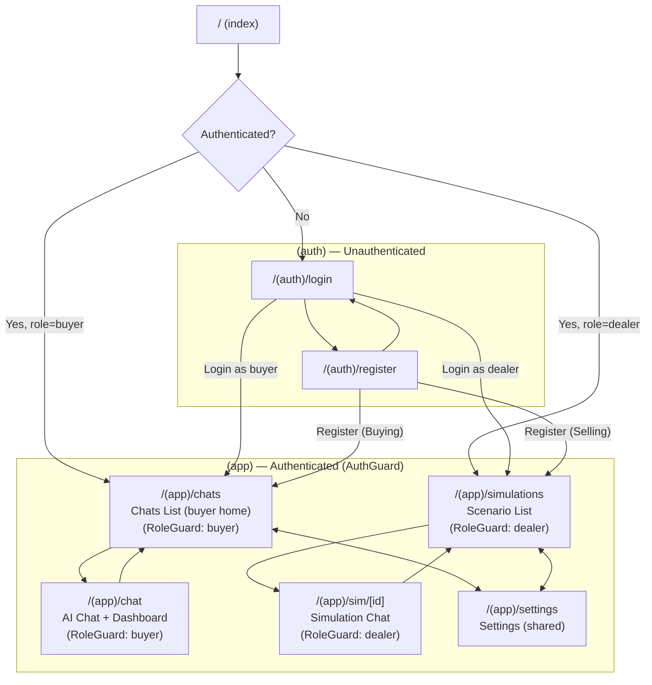
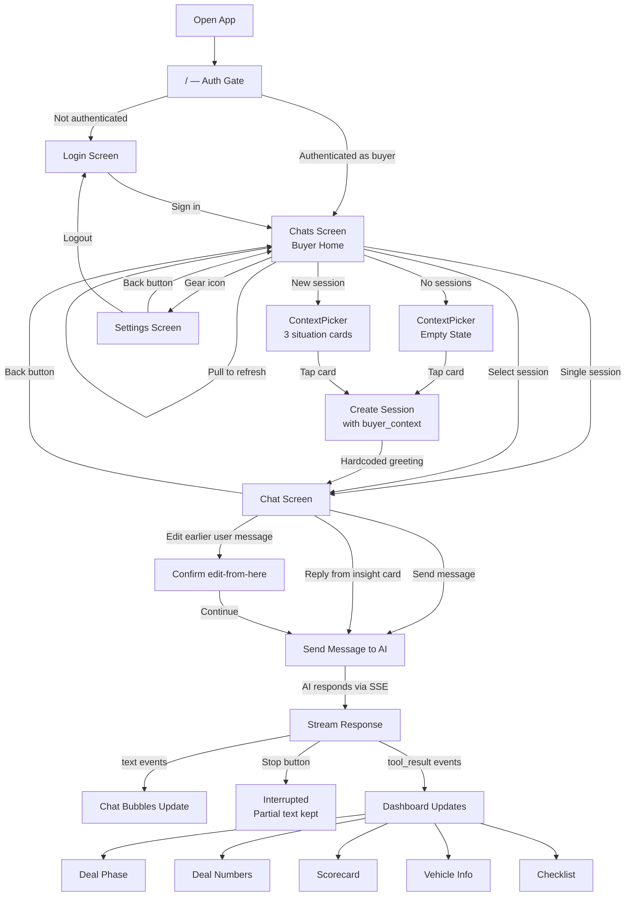

# Site Map and User Flows

**Last updated:** 2026-04-10

---

## Table of Contents

1. [Site Map](#site-map)
2. [Tab/Screen Structure by Role](#tabscreen-structure-by-role)
3. [User Flows](#user-flows)
   - [Buyer Flow](#buyer-flow)
   - [Dealer Flow](#dealer-flow)
   - [Auth Flow](#auth-flow)

---

## Site Map

All routes use Expo Router file-based routing. The root `index` screen acts as an auth gate and role-based redirect. All authenticated screens live under a single `(app)` route group, with `RoleGuard` components on individual screens enforcing role-based access.



---

## Tab/Screen Structure by Role

| Route | Screen | Buyer | Dealer | Guard | Description |
|---|---|:---:|:---:|---|---|
| `/(auth)/login` | Login | -- | -- | None | Email/password login with quick sign-in buttons |
| `/(auth)/register` | Register | -- | -- | None | Account creation with "Buying"/"Selling" role selection |
| `/(app)/chats` | Chats | Yes | -- | RoleGuard(buyer) | Buyer home screen; session list with search, Active/Past sections, SessionCard (phase dot, preview, deal summary); single-session fast-path; ContextPicker empty state |
| `/(app)/chat` | Chat | Yes | -- | RoleGuard(buyer) | AI chat with deal dashboard (phase, numbers, scorecard, vehicle, checklist); context pressure banner from messages API; system-role bubbles for compaction notices; explicit "edit from here" action on eligible user messages; back button to chats list; dynamic title from session |
| `/(app)/simulations` | Simulations | -- | Yes | RoleGuard(dealer) | Browse AI training scenarios; start a new simulation |
| `/(app)/sim/[id]` | Simulation Chat | -- | Yes | RoleGuard(dealer) | Live chat session for a selected training scenario |
| `/(app)/settings` | Settings | Yes | Yes | None (shared) | App settings (theme toggle, logout); back button with animated icon entrance |

The `(app)` route group has an `AuthGuard` that redirects to `/(auth)/login` if the user is not authenticated. Individual screens use `RoleGuard` to enforce role-based access and redirect mismatched users to their default screen.

---

## User Flows

### Buyer Flow

Open app, authenticate, manage sessions from chats list, chat with AI advisor, receive dashboard updates.



### Dealer Flow

Open app, authenticate, browse training scenarios, start and practice a simulation.


### Auth Flow

Register a new account or log in, then redirect based on role.

```mermaid
flowchart TD
    START[App Launch] --> AUTH_CHECK{Authenticated?}

    AUTH_CHECK -- No --> LOGIN[Login Screen]
    AUTH_CHECK -- Yes --> ROLE_CHECK{User Role?}

    LOGIN --> |Enter credentials| VALIDATE[Validate Login]
    LOGIN --> |Quick sign-in button| VALIDATE
    LOGIN --> |"Don't have an account?"| REGISTER[Register Screen]

    REGISTER --> |"Buying" or "Selling"\nrole selection| CREATE[Create Account]
    REGISTER --> |"Already have an account?"| LOGIN

    CREATE --> ROLE_CHECK
    VALIDATE --> ROLE_CHECK

    ROLE_CHECK -- buyer --> BUYER["/(app)/chats"]
    ROLE_CHECK -- dealer --> DEALER["/(app)/simulations"]
```
