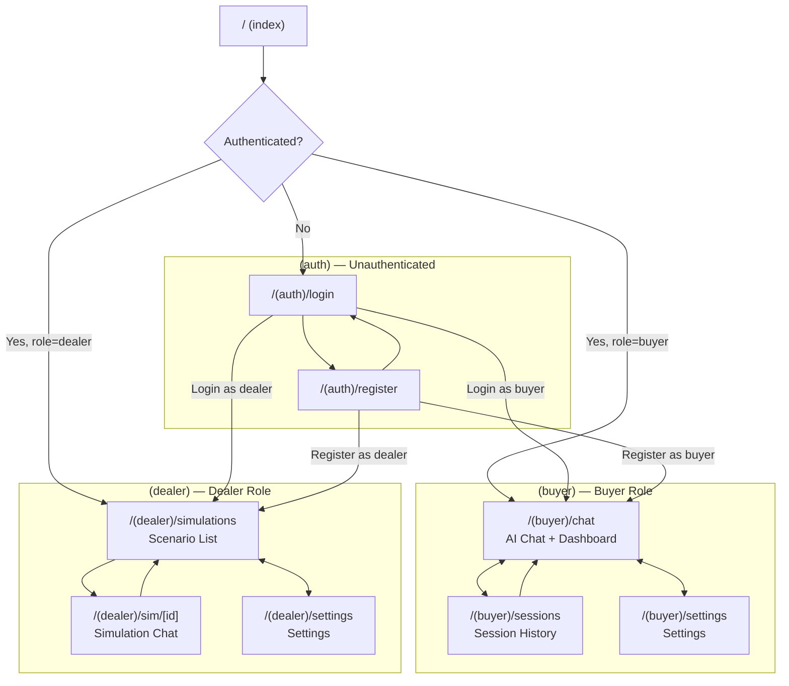
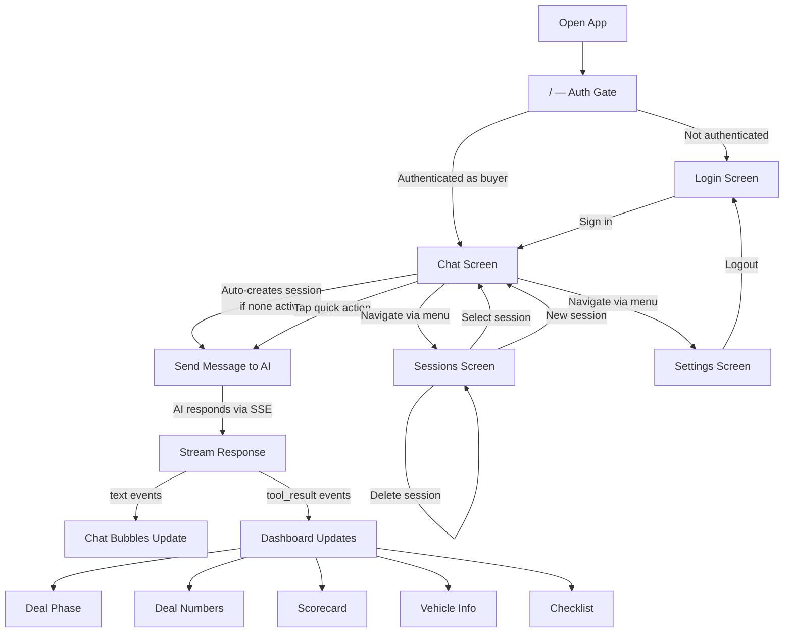
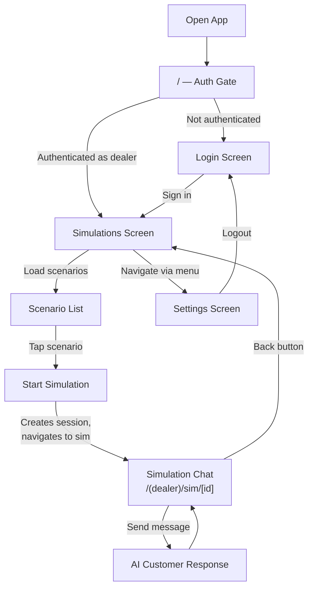
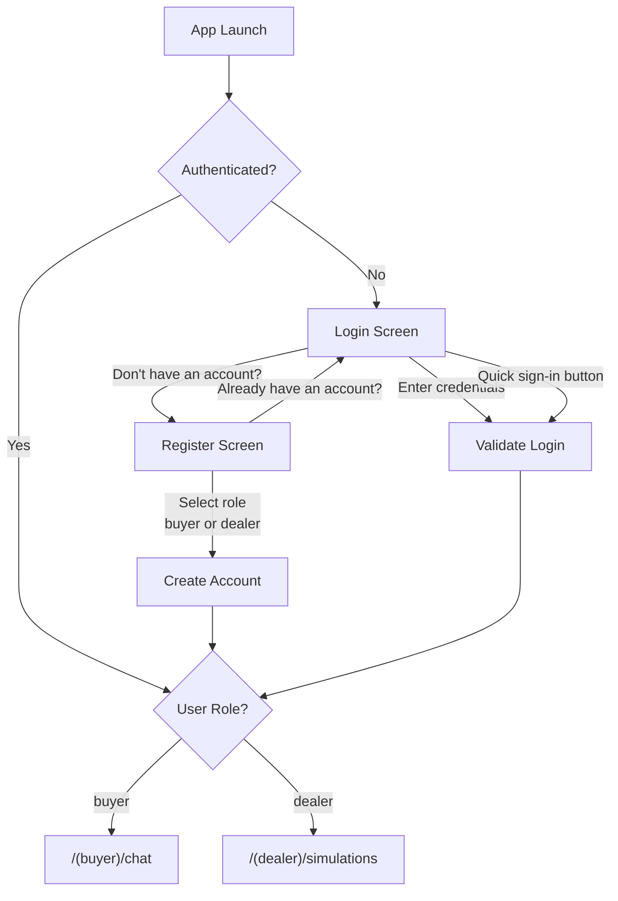

# Site Map and User Flows

**Last updated:** 2026-03

---

## Table of Contents

1. [Site Map](#site-map)
2. [Tab/Screen Structure by Role](#tabscreen-structure-by-role)
3. [User Flows](#user-flows)
   - [Buyer Flow](#buyer-flow)
   - [Dealer Flow](#dealer-flow)
   - [Auth Flow](#auth-flow)

---

## Site Map

All routes use Expo Router file-based routing. The root `index` screen acts as an auth gate and role-based redirect.

---

## Tab/Screen Structure by Role

| Route | Screen | Buyer | Dealer | Description |
|---|---|:---:|:---:|---|
| `/(auth)/login` | Login | -- | -- | Email/password login with quick sign-in buttons |
| `/(auth)/register` | Register | -- | -- | Account creation with role selection (buyer/dealer) |
| `/(buyer)/chat` | Chat | Yes | -- | AI chat with deal dashboard (phase, numbers, scorecard, vehicle, checklist) |
| `/(buyer)/sessions` | Sessions | Yes | -- | List of past chat sessions; select to resume or delete |
| `/(buyer)/settings` | Settings | Yes | -- | App settings (theme toggle, logout) |
| `/(dealer)/simulations` | Simulations | -- | Yes | Browse AI training scenarios; start a new simulation |
| `/(dealer)/sim/[id]` | Simulation Chat | -- | Yes | Live chat session for a selected training scenario |
| `/(dealer)/settings` | Settings | -- | Yes | App settings (theme toggle, logout) |

Both buyer and dealer route groups have auth guards that redirect to `/(auth)/login` if the user is not authenticated.

---

## User Flows

### Buyer Flow

Open app, authenticate, chat with AI advisor, receive dashboard updates, manage sessions.

### Dealer Flow

Open app, authenticate, browse training scenarios, start and practice a simulation.

### Auth Flow

Register a new account or log in, then redirect based on role.

